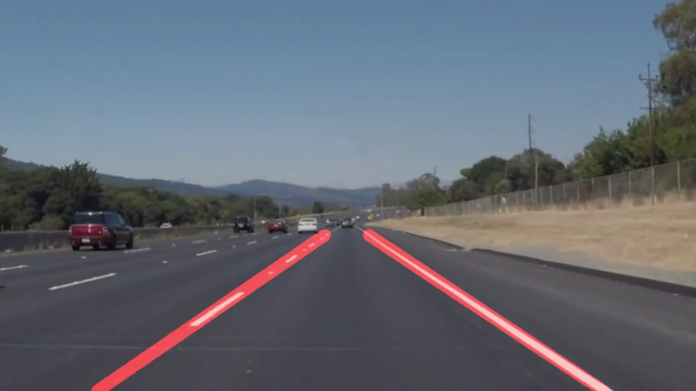
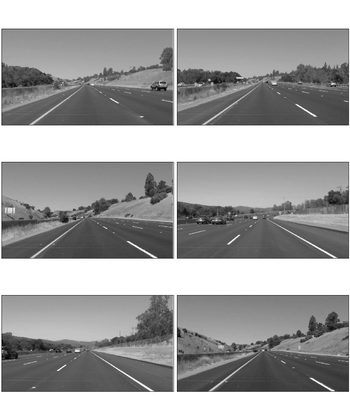

# Lane Line Identification
***
This project uses traditional computer vision techniques implemented in Python and OpenCV to identify lane lines in the road. The image data is collected from a front facing video camera mounted on a car driving in freeway traffic. This project was done as part of the Udacity self driving car nanodegree program.


[](https://youtu.be/gcRVc0u5Qr0)
[Video Link](https://youtu.be/gcRVc0u5Qr0)

The image processing pipeline used involves the following techniques

1. Guassian blur to remove high frequency information.
2. Canny edge detection.
3. Region of interest mask.
4. Hough transform line detection.


***
## Dataset

Detecting lane lines in the road is an important feature extraction step used for subsequent tasks in an autonomous vehicle such as pose estimation, navigation and guidance. The vision systems on an autonomous vehicle is a primary candidate to detect such road markings. This is in principle due to the development of road markings being designed to be easily detectable and identifiable for the human visual system. However detecting road lane lines can still be a difficult task in computer vision due to the vast range of varying road and weather conditions that can be encountered when driving, and the varying design and colors of the lane lines themselves. 

For this task I develop a system that is capable of detecting lane lines in video data taken from a front facing mount on a car. As the system is required to be fast and running in real time for a final hardware implementation, the pipeline will be designed to work on individual frames and take no account of any temporal or optical flow information present in the video data. Examples of the types of image we want to be able to detect lane lines on are shown below


***
## Canny Edge Dectection

The Canny edge detector is a classic edge detection algorithm proposed by John F. Canny in 1986. The procedure uses multi-stage approach to reduce the amount of information in an image down to the useful structural edges present. It has been used widely as a preprocessing step in many computer vision applications. To effectively use the canny edge detection algorithm built into OpenCV the procedure can be broken down to three key stages

1. Reduce image to grayscale.
2. Reduce high frequency information with Gaussian blur.
3. Use the Canny edge detector

### Reduce Image to Grayscale

An RGB color image is a vector valued function across the image spatial domain. The Canny algorithm uses the gradient of this function with edges responding to large gradients in the image. To easily identify edges present in an image, it is easier to project this vector valued function into a single scaler valued function to have absolute agreement of edges between image channels. To do this we convert the three channel RGB image to a single channel grayscale image.

```python
def grayscale(img):
    return cv2.cvtColor(img, cv2.COLOR_RGB2GRAY)
```



### Gaussian Blur

Edge detection found using the canny algorithm is easily impacted by any noise in the image. Since possible noise artifacts present in the image are likely to be high frequency in nature, and the useful edge information is much lower frequency this potential noise can easily be eliminated using a low pass filter. To perform low pass filtering on the image a Gaussian filter is convolved across the image, this can be done using the OpenCV Gaussian blur function. 

[Gaussian Blur OpenCV](https://docs.opencv.org/2.4/modules/imgproc/doc/filtering.html?highlight=gaussianblur#gaussianblur)

```python
def gaussian_blur(img, kernel_size = 5):
    return cv2.GaussianBlur(img, (kernel_size, kernel_size), 0)
```

The kernel size of the Gaussian filter is a hyper-parameter that requires choice by empirical testing. The standard deviation of the Gaussian filter is calculated using the kernel size according the the documentation. The kernel choice is then equivalent to choosing the bandwidth of the low pass filtering. Empirical testing found 5 to be a good choice for the kernel size. 


