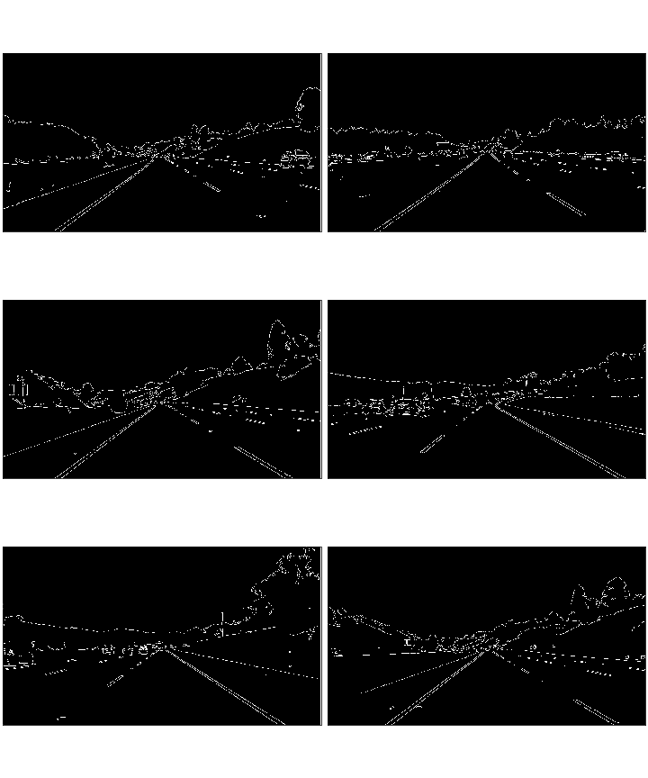
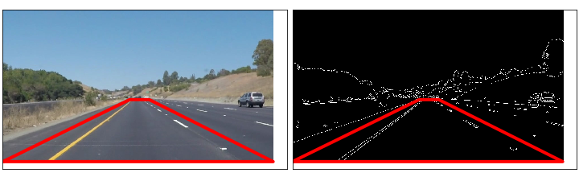
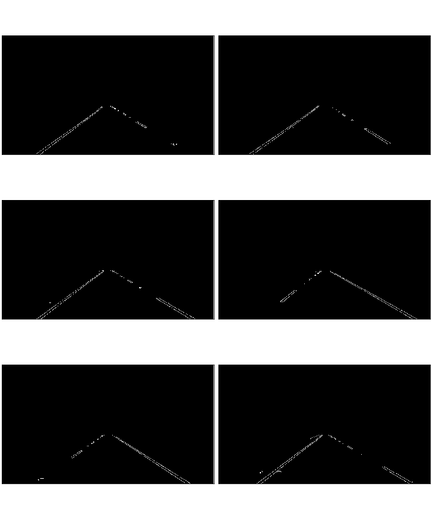
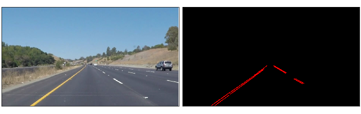
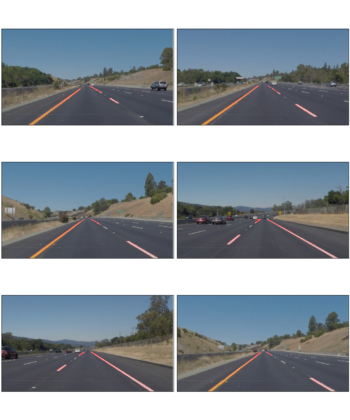
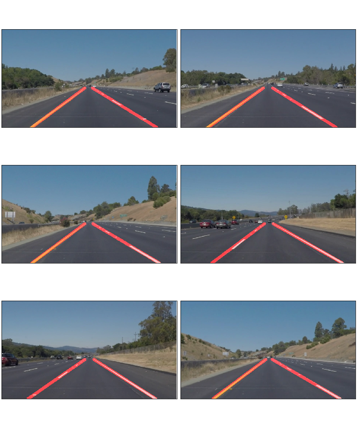

# Lane Line Identification
***
This project uses traditional computer vision techniques implemented in Python and OpenCV to identify lane lines in the road. The image data is collected from a front facing video camera mounted on a car driving in freeway traffic. This project was done as part of the Udacity self driving car nanodegree program.


[](https://youtu.be/gcRVc0u5Qr0)
[Video Link](https://youtu.be/gcRVc0u5Qr0)

The image processing pipeline used involves the following techniques

1. Guassian blur to remove high frequency information.
2. Canny edge detection.
3. Region of interest mask.
4. Hough transform line detection.


***
## Dataset

Detecting lane lines in the road is an important feature extraction step used for subsequent tasks in an autonomous vehicle such as pose estimation, navigation and guidance. The vision systems on an autonomous vehicle is a primary candidate to detect such road markings. This is in principle due to the development of road markings being designed to be easily detectable and identifiable for the human visual system. However detecting road lane lines can still be a difficult task in computer vision due to the vast range of varying road and weather conditions that can be encountered when driving, and the varying design and colors of the lane lines themselves. 

For this task I develop a system that is capable of detecting lane lines in video data taken from a front facing mount on a car. As the system is required to be fast and running in real time for a final hardware implementation, the pipeline will be designed to work on individual frames and take no account of any temporal or optical flow information present in the video data. Examples of the types of image we want to be able to detect lane lines on are shown below


***
## Canny Edge Dectection

The Canny edge detector is a classic edge detection algorithm proposed by John F. Canny in 1986. The procedure uses multi-stage approach to reduce the amount of information in an image down to the useful structural edges present. It has been used widely as a preprocessing step in many computer vision applications. To effectively use the canny edge detection algorithm built into OpenCV the procedure can be broken down to three key stages

1. Reduce image to grayscale.
2. Reduce high frequency information with Gaussian blur.
3. Use the Canny edge detector

### Reduce Image to Grayscale

An RGB color image is a vector valued function across the image spatial domain. The Canny algorithm uses the gradient of this function with edges responding to large gradients in the image. To easily identify edges present in an image, it is easier to project this vector valued function into a single scaler valued function to have absolute agreement of edges between image channels. To do this we convert the three channel RGB image to a single channel grayscale image.

```python
def grayscale(img):
    return cv2.cvtColor(img, cv2.COLOR_RGB2GRAY)
```


### Gaussian Blur

Edge detection found using the canny algorithm is easily impacted by any noise in the image. Since possible noise artifacts present in the image are likely to be high frequency in nature, and the useful edge information is much lower frequency this potential noise can easily be eliminated using a low pass filter. To perform low pass filtering on the image a Gaussian filter is convolved across the image, this can be done using the OpenCV Gaussian blur function. 

[Gaussian Blur OpenCV](https://docs.opencv.org/2.4/modules/imgproc/doc/filtering.html?highlight=gaussianblur#gaussianblur)

```python
def gaussian_blur(img, kernel_size = 5):
    return cv2.GaussianBlur(img, (kernel_size, kernel_size), 0)
```

The kernel size of the Gaussian filter is a hyper-parameter that requires choice by empirical testing. The standard deviation of the Gaussian filter is calculated using the kernel size according the the documentation. The kernel choice is then equivalent to choosing the bandwidth of the low pass filtering. Empirical testing found 5 to be a good choice for the kernel size. 


### Canny Edge Detection
Finally we can use the canny edge detection algorithm on the preprocessed image of the road. The OpenCV implementation of the Canny edge detection algorithm has two threshold parameter values which again need to be chosen based on empirical testing.

[Canny Edge Detector OpenCV](https://docs.opencv.org/2.4/doc/tutorials/imgproc/imgtrans/canny_detector/canny_detector.html)


```python
def canny(img, low_threshold = 50, high_threshold = 150):
    return cv2.Canny(img, low_threshold, high_threshold)
```
The two threshold parameters control the cutoff ranges of what gradients between pixels are to be considered edges and which are not.

- Any gradient greater then the high threshold is considered as an edge.
- Any gradient lower then the low threshold is not considered as an edge.
- Any gradient in between the two threshold is considered to be a gradient, on the condition that it is adjacent to a pixel with a gradient that is above the higher threshold

These conditions allow the identification of sharpe lines corresponding to the presence of and edge in the image.



***
## Region of Interest Mask

The camera is mounted in a fixed position on the car and we therefore know in which region of image the road will be. The other regions of the image will contain information that will not help with the lane line positioning and can even make identification of the lines more challenging. It make sense then to remove any edges not occurring within the region of interest with a mask technique.

```python
def region_of_interest(img, vertices):
    """
    Applies an image mask.
    Only keeps the region of the image defined by the polygon
    formed from `vertices`. The rest of the image is set to black.
    """
    #defining a blank mask to start with
    mask = np.zeros_like(img)   
    
    #defining a 3 channel or 1 channel color to fill the mask with depending on the input image
    if len(img.shape) > 2:
        channel_count = img.shape[2]  # i.e. 3 or 4 depending on your image
        ignore_mask_color = (255,) * channel_count
    else:
        ignore_mask_color = 255
        
    #filling pixels inside the polygon defined by "vertices" with the fill color    
    cv2.fillPoly(mask, vertices, ignore_mask_color)
    
    #returning the image only where mask pixels are nonzero
    masked_image = cv2.bitwise_and(img, mask)
    return masked_image
```

The region which was found to contain the most amount of road and exclude the most amount of background across the test images was a four sided polygon.




Excluding all content outside the ROI mask for the Canny edge detector then further reduces the information in the image to the lane line edges.




***
## Hough Transform


The Hough transform is a feature extraction technique that is popular in computer vision and image analysis that is used to find straight lines in an image. Any "x vs y" line can be transformed to a point in Hough space, the basis of which is made up of "m vs b" (gradient vs intercept of the line). The hough transform is the algorithm that converts the representation of straight lines between these two spaces. Any line in an image has a direct mapping to a point in Hough space, for more details of the theoretical considerations underlining the Hough transform see the associated link.

[Hough Transform](https://docs.opencv.org/2.4/doc/tutorials/imgproc/imgtrans/hough_lines/hough_lines.html)

It is often convenient to work with the Hough transform in polar coordinates, doing so results in the following hyper-parameters that again need to be found by empirically testing on test data sets.

- rho : Distance resolution in pixels of the Hough grid
- theta : Angular resolution in radians of the Hough grid
- threshold : Minimum number of votes (Intersections on the Hough Grid)
- min line length : Minimum number of pixels making up the line
- max line gap : Maximum gap in pixels between the connectable line segments 

The optimal hyper paramters for the Hough transform are given as default values to the Hough tranform function call below

```python
def draw_lines(img, lines, color=[255, 0, 0], thickness=2):
    
    for line in lines:
        for x1,y1,x2,y2 in line:
            cv2.line(img, (x1, y1), (x2, y2), color, thickness)

def hough_lines_basic(img, rho=2, theta=np.pi/180, threshold=20, min_line_len=25, max_line_gap=10):
    """
    `img` should be the output of a Canny transform.
    Returns an image with hough lines drawn.
    """
    lines = cv2.HoughLinesP(img, rho, theta, threshold, np.array([]), minLineLength=min_line_len, maxLineGap=max_line_gap)
    line_img = np.zeros((img.shape[0], img.shape[1], 3), dtype=np.uint8)
    draw_lines(line_img, lines)
    return line_img
```

The image below shows in red all lines identified by the Hough transform side by side with the original image which was input to the pipeline.



Using the following function is it possible to view the dectected lines superimposed on the input image set for the whole test data set 

```python
def weighted_img(img, initial_img, α=0.8, β=1., λ=0.)
   
    return cv2.addWeighted(initial_img, α, img, β, λ)

```




The pipeline presented so far does quite a good job at identifying lines associated with the lane lines on the road. However there are still some issue with the processing pipeline in its current form.

- Multiple edges are associated with a given lane line

- Some lane lines are only partially recognized

- The design of some lane lines are dashed, therefore the lines need to be interpolated for the system to know there should be lane lines between these dashes.

***

## Extending the Pipeline by Averaging and Extrapolating

We now consider how to extend the pipeline to resolve some of these issues.

- Ultimately what we require is two single lines, one corresponding to each lane line. 

- A suitable approach to achieve this then is to average the gradient and intercept of all identified lines associated with each lane to find two final lane lines. 

- The identified lines from the hough transform can be separated into the associated left and right lane groupings by considering the gradients as they will have opposite signs. 

- We also apply weighting to the averaging by weighting the gradient and intercept of each line by the l2 distance of each line. This is done as longer lines should be more certainly associated with lane line as opposed to small elements of noise in the road.


The following two functions calculate the weighted average of lines identifed by the hough tranforms to produce a final left and right lane line, and then find the locations on which to draw the new lines.

```python
def line_2_points(y1,y2,line):

    if len(line) != 2:
        return None
    
    gradient, intercept = line
    x1 = int((y1 - intercept)/gradient)
    x2 = int((y2 - intercept)/gradient)
    y1 = int(y1)
    y2 = int(y2)
    
    return((x1,y1), (x2,y2))
    
def calculate_average_lines(lines):
    
    left_lane_lines = []
    left_line_distances = []
    right_lane_lines = []
    right_line_distances = []
    
    for i,line in enumerate(lines):
        for x1,y1,x2,y2 in line:
            if (x1==x2 or y1==y2):
                #If we incounter a horiztonal or vertical line
                #then continue to next iteration
                continue
            #Calcuate attributes of the line
            gradient = (y2-y1)/(x2-x1)
            intercept = y2 - gradient*x2
            l2_distance = np.sqrt((y2-y1)**2 + (x2-x1)**2)
            
            if gradient > 0:
                right_lane_lines.append((gradient, intercept))
                right_line_distances.append(l2_distance)
            else:
                left_lane_lines.append((gradient, intercept))
                left_line_distances.append(l2_distance)
                
            
    right_sum_dis = np.sum(right_line_distances)
    left_sum_dis = np.sum(left_line_distances)
            
    right_line_distances = np.asarray(right_line_distances)
    right_line_distances = np.asarray(right_line_distances)
    
    weights_right = right_line_distances / right_sum_dis
    weights_left = left_line_distances / left_sum_dis
    
    average_right_lane = np.dot(weights_right, right_lane_lines)
    average_left_lane = np.dot(weights_left, left_lane_lines)
    
    return average_left_lane, average_right_lane
```

The final identifed lane lines found using this image are then superimposed into the test data set.


